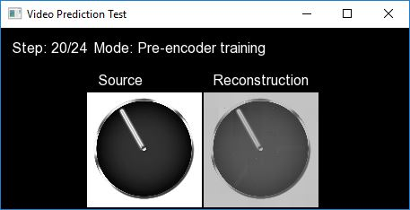
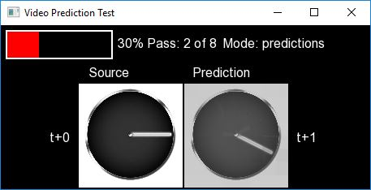
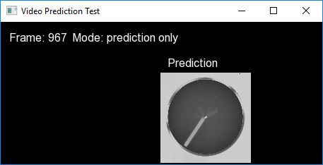

<!---
  EOgmaNeo
  Copyright(c) 2017 Ogma Intelligent Systems Corp. All rights reserved.

  This copy of EOgmaNeo is licensed to you under the terms described
  in the EOGMANEO_LICENSE.md file included in this distribution.
--->

# EOgmaNeo Example Applications

## CMake options

The following test applications are only built if the CMake script is told to via the `BUILD_EXAMPLES` CMake variable, e.g. `cmake -DBUILD_EXAMPLES=ON .`

The `VideoPrediction` example also requires that the `BUILD_PREENCODERS` variable is set, e.g. `cmake -DBUILD_PREENCODERS=ON -DBUILD_EXAMPLES=ON .` This example relies upon OpenCV to load a movie file.

## SaveLoad

This example is very similar to the `Python/sineWaveExample.py` file. It:

- creates an EOgmaNeo hierarchy,
- presents it with a sine wave sequence,
- saves out this trained hierarchy,
- creates a new empty hierarchy, and
- loads the saved hierarchy back into it.

It then runs both hierarchies feeding predictions from each hierarchy back into the hierarchy.

## VideoPrediction

This example is a replication of the [OgmaNeo](https://github.com/ogmacorp/OgmaNeo) VideoPrediction example (found [here](https://github.com/ogmacorp/OgmaNeoDemos/blob/master/demos/Video_Prediction.cpp)). In this case it uses the EOgmaNeo library to predict the next frame of a sequence of images.

In the OgmaNeo version, a special encoder/decoder pair (distance encoding) is used as an initial input layer, that image data is sent too. In this EOgmaNeo version an Image Pre-encoder is used to take image sequences and produce the sparse chunked representations that the EOgmaNeo predictive hierarchies take as input. Due to this the pre-encoder requires training to be able to produce distinct representations for every image it is show in the sequence.

This example is thus split into three sections/steps:

1. Repeatable show the video image sequence to the Image Pre-encoder,
1. Repeatable show the EOgmaNeo predictive hierarchy the video image sequence (after passing images through the trained Image Pre-encoder),
1. Loop indefinitely, feeding the EOgmaNeo hierarchy predictions back as input to itself (via the Image Pre-encoder).

**NOTE:** In step 2 the playback of the video is deliberately slowed down to see the hierarchy output per frame/step.

The original Tesseract movie, and a simpler one-arm dial/clock face movie, are included for testing the image pre-encoder and EOgmaNeo.

The `Escape` key can be used to skip each step and exit the application.

Step 1 - Image pre-encoder training:  
Left image is source movie frame and input to the pre-encoder.  
Right image is the reconstruction obtained from the image pre-encoder, by using the sparse chunked representation that is output from the pre-encoder.

Step 2 - EOgmaNeo hierarchy training:  
Left image is the source movie frame.  
Right image is the EOgmaNeo predicted output.

Step 3 - EOgmaNeo prediction feedback/looping:  
Right image is the EOgmaNeo predicted output, that is then fed back into the hierarchy to predict the next image.

# Media files

<!--- Clock-TwoArm - https://commons.wikimedia.org/wiki/File:AnalogClockAnimation1_2hands_12h_in_realtime.gif -->
- Clock-OneArm - https://commons.wikimedia.org/wiki/File:Clock-with-one-second-time-counter-animated.gif
- Tesseract - https://en.wikipedia.org/wiki/File:Tesseract.gif

EOgmaNeo Copyright (c) 2017 [Ogma Intelligent Systems Corp](https://ogmacorp.com). All rights reserved.
